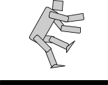
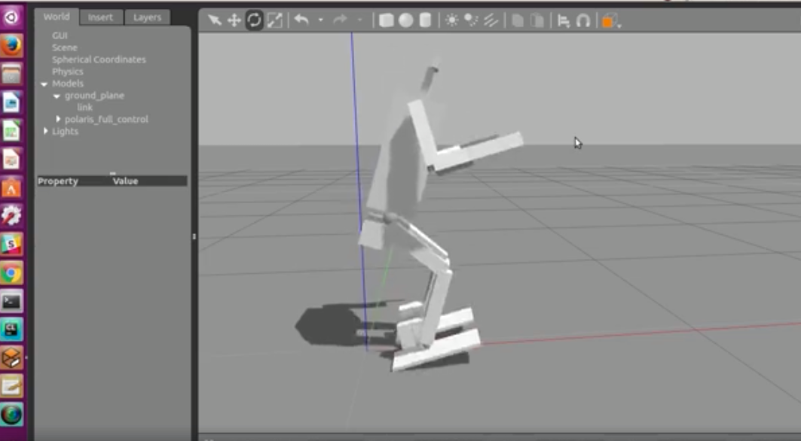
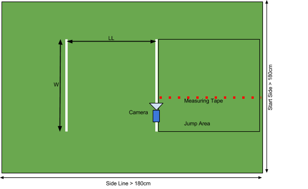

Long Jump - HuroCup Laws of the Game

Version: 15.0.2 Date: Sun Apr 23 2017 06:37:03 GMT+0800 (HKT)

	

### HuroCup Laws of the Game

### Long Jump (Pro/U19)

Jacky Baltes

Educational Robotics Center

Department of Electrical Engineering

National Taiwan Normal University

Taipei, 10610, Taiwan

[jacky.baltes@ntnu.edu.tw](jacky.baltes@ntnu.edu.tw)

*Abstract*

*The following rules and regulations govern the long jump event of HuroCup, a robotic game and robotics benchmark problem for humanoid robots.*

**Latest Version of the Rules for HuroCup**

The latest official version of the rules of the game for HuroCup is always available from the [HuroCup Facebook Page](https://www.google.com/url?q=http://www.facebook.com/groups/hurocup&sa=D&ust=1514012337879000&usg=AFQjCNH-GedtqkeDlW9rGxoqGdG5hSJjRg).

**Changes to the Long Jump rules of HuroCup**

The long jump event was introduced in 2015.

**Long Jump**

The goal of the long jump competition is to encourage research in extremely dynamic humanoid robots able to create strong forces and compliant enough to allow for a soft landing.

**HuroCup Long Jump - Laws of the Game**

The following laws describe the specifics of the long jump event. For general specifications relevant to all HuroCup events (e.g., robot dimensions, playing field and lighting, responsibility of the referees) please refer to [General - HuroCup Laws of the Game](https://www.google.com/url?q=https://docs.google.com/document/d/15laUlB6uZ56J5WpGPhepb7P8O7ul-8K5sgdf4uwu4Ak/pub&sa=D&ust=1514012337881000&usg=AFQjCNF-SujWAltWzRO2OXL4dwm2jsZAlw).

#### [LJ-1]: Field of Play

[LJ-1.1]: The long jump competition is played on a field with a minimum dimension of 1.8m by 1.8m. See Figure [Long Jump Field](https://docs.google.com/document/d/1eNKoKVrOe-rQkWAM51IBClWYoIAtyyjrTyqxc2hsdXM/pub#id.nxpjv9n9wwb4).

[LJ-1.2]: The field is marked with two lines: (a) the start line, and (b) the jump line. The distance between the start line and the jump line is $LL.

[LJ-1.3]: The width of all lines is $L.

Dimension | Comment | Kid Size | Adult Size | U19
:- | :- | -: | -: | -:
$LL | Distance between start and jump line | 50cm | 100cm | 50cm
$W |Width of the field lines|50cm|100cm|50cm
$L|Width of the start and jump line|3cm - 7cm|3cm - 7cm|3cm -7cm

Long Jump Field

#### [LJ-2]: Number of Robots

[LJ-2.1]: A single robot competes in a match.

#### [LJ-3]: The Players

[LJ-3.1]: Please refer to [General - HuroCup Laws of the Game](https://www.google.com/url?q=https://docs.google.com/document/d/15laUlB6uZ56J5WpGPhepb7P8O7ul-8K5sgdf4uwu4Ak/pub&sa=D&ust=1514012337892000&usg=AFQjCNECK7oe_SQp2KcKIsxktkPLpsaE6g) for detailed information about the players.

#### [LJ-4]: The Referee

[LJ-4.1]: Please refer to [General - HuroCup Laws of the Game](https://www.google.com/url?q=https://docs.google.com/document/d/15laUlB6uZ56J5WpGPhepb7P8O7ul-8K5sgdf4uwu4Ak/pub&sa=D&ust=1514012337892000&usg=AFQjCNECK7oe_SQp2KcKIsxktkPLpsaE6g) for detailed information about the referee and his or her duties.

#### [LJ-5]: The Assistant Referee

[LJ-5.1]: Please refer to [General - HuroCup Laws of the Game](https://www.google.com/url?q=https://docs.google.com/document/d/15laUlB6uZ56J5WpGPhepb7P8O7ul-8K5sgdf4uwu4Ak/pub&sa=D&ust=1514012337892000&usg=AFQjCNECK7oe_SQp2KcKIsxktkPLpsaE6g) for detailed information about the assistant referee and his or her duties.

#### [LJ-6]: Game Play

[LJ-6.1]: A single robot is designated the jumper. All other robots must be outside of the playing field.

[LJ-6.2]: The only robot allowed to move during a run is the designated jumper.

[LJ-6.3]: The jumper will be placed by the handler in the area between the start and jump line. The robot is not allowed to touch the jump line.

[LJ-6.4]: The referee will signal the start of the competition by blowing the whistle.

[LJ-6.5]: After the referee gives the start signal, the robot must use a single jump to jump as far as possible across the jump line.

[LJ-6.6]: A robot is not allowed to leave the playing field.

[LJ-6.7]: Each robot may have at most one human handler associated with it.

[LJ-6.8]: The human handlers are not allowed to interfere in any way with other robots, the referee, or other human handlers.

[LJ-6.9]: A human handler may only enter the playing field or touch his/her robot with the permission of the referee.

[LJ-6.10]: The end of the competition is signaled by the referee by blowing the whistle a second time. The referee terminates the competition if

1. the robot has successfully made a jump,
2. the robot was unable to jump within 30 seconds after the referee signalled the start of try,
3. the robot falls and is unable to get up on its own or is immobilized by a technical defect,
4. the robot leaves the playing area by completely crossing the start line or the implicit side lines of the rectangle formed by the start and jump line.

[LJ-6.11]: At the end of the try, another robot will be designated the jumper.

[LJ-6.11]: There are three rounds in the event. After all robots have jumped, the next round is started immediately afterwards. The order of the robots is the same as the first round.

#### [LJ-7]: Fouls and Misconduct

[LJ-7.1]: The robot did not have both feet in the air during at least part of the jump.

[LJ-7.2]: The robot handler touches the robot.

[LJ-7.3]: Any infractions as listed by [General - HuroCup Laws of the Game](https://www.google.com/url?q=https://docs.google.com/document/d/15laUlB6uZ56J5WpGPhepb7P8O7ul-8K5sgdf4uwu4Ak/pub&sa=D&ust=1514012337892000&usg=AFQjCNECK7oe_SQp2KcKIsxktkPLpsaE6g) as far as they are applicable in this event.

[LJ-7.4]: Any team that commits one of the infractions listed in this section will be penalized by having the try declared invalid.

#### [LJ-8]: Method of Scoring

[LJ-8.1]: The jump distance is defined as the shortest distance measured between the back of each foot that touches the ground to the jump line.

[LJ-8.2]: As the long jump event is a very dynamic event and requires extremely quick measurements, a camera will be mounted beside the robot on the jump line and record the jump. To aid in calibration of the camera image, a measuring tape will be mounted on one side of the robot’s jump point.

[LJ-8.3]: All robots that have not managed to jump for more than 5mm are assigned 0 points.

[LJ-8.4]: Among the robots that have jumped more than 5mm, the robots are ranked (i.e., 1st place, 2nd place) based on the maximum jump distance.

[LJ-8.5]: For more details about the point allocation, please refer to [Point Allocation [Organization - HuroCup Laws of the Game]](https://www.google.com/url?q=https://docs.google.com/document/d/1kn2_dtNp65n1j5TjZWJVIlTKRFcNkTSpARkdhLHNA1c/edit%23bookmark%3Did.rzzlothp76e9&sa=D&ust=1514012337899000&usg=AFQjCNFhT_c5bFUcL4OcbYZEJ3udNbjGhQ).

#### [WL-1]: Tiebreaker

[LJ-8.6]: In case two or more robots have the same number of points after all rounds in the long jump event, the sum of the maximum long jump distances in all rounds will be used as tiebreaker.

[L-10.2]: In case two or more robots have the same number of points after all rounds and are still tied after applying the previous tiebreaker, the maximum jump distance in a single round will be used as a tiebreaker.

#### Official World Records

This section contains the list of official world records for the HuroCup Robot long jump competition first introduced in the 2015 WorldCup.

Kid Size

| Date | Event | Team | Affiliation	| Distance |
| - | - | - | - | - |

Adult Size

| Date | Event | Team | Affiliation	| Distance |
| - | - | - | - | - |

Junior Size

| Date | Event | Team | Affiliation	| Distance |
| - | - | - | - | - |

通过Google云端硬盘发布–举报滥用行为–每5分钟自动更新一次

