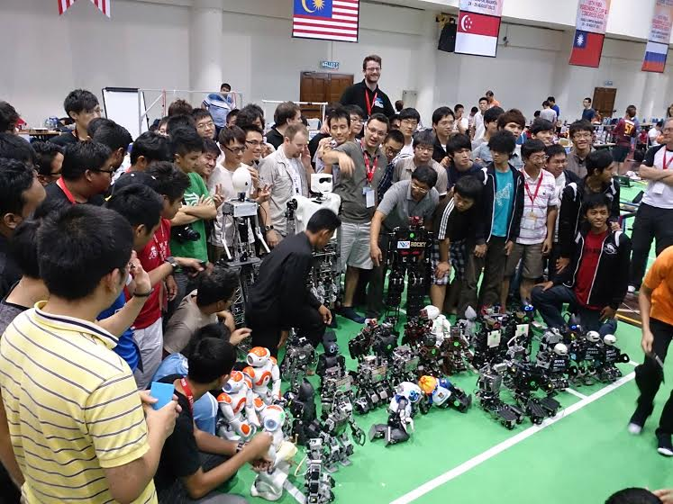

>Jacky Baltes

>Autonomous Agents Laboratory

>University of Manitoba

>Winnipeg, Manitoba Canada, R3T 2N2  
>[jacky@cs.umanitoba.ca](jacky@cs.umanitoba.ca)

#####Abstract

The following rules and regulations govern the All-Round event of HuroCup, a robotic septathlon where a single robot has to successfully master nine events. The robot must not be modified between events.The goal is to develop a benchmark problem for humanoid robotics that stresses versatility and robustness of the system.

### Latest Version of the Rules for HuroCup
The latest official version of the rules of the game for HuroCup is always available from the [HuroCup Facebook Page](https://www.google.com/url?q=http://www.facebook.com/groups/hurocup&sa=D&ust=1513944760084000&usg=AFQjCNE0KTSprJ8RL-CMw8_byB8b5R4gzQ).

### Changes to the All-Round rules of HuroCup
Introduction of a new event, Archery, and merging both events of Obstacle Run and Lift and Carry into a single event, Spartan Race.

### All-Round

This section contains information about the All-Round humanoid robot competition as part of HuroCup. The All-Round competition is the most important and prestigious HuroCup event as it tests the versatility, flexibility, and robustness of a humanoid robot. The winner in the all-round competition is determined by the single robot with the most points over all nine HuroCup events: sprint, penalty kick, obstacle run, spartan race, weight lifting, marathon, basketball, long jump, archery, and mini-drc.

#####[AR-1]: Field of Play

[AR-1.1]: There is no separate field of play for the All-Round competition. Teams participate with a single robot in multiple HuroCup events.

#####[AR-2]: Number of Robots

[AR-2.1]: A single robot competes in a match.

#####[AR-3]: The Player

[AR-3.1]: Please refer to [General - HuroCup Laws of the Game](https://www.google.com/url?q=https://docs.google.com/document/d/15laUlB6uZ56J5WpGPhepb7P8O7ul-8K5sgdf4uwu4Ak/pub&sa=D&ust=1513944760087000&usg=AFQjCNFnwQNyPftmr-jLt5sQM-ms_b4KXg) for detailed information about the players.

#####[AR-4]: The Referee

[AR-4.1]: Please refer to [General - HuroCup Laws of the Game](https://www.google.com/url?q=https://docs.google.com/document/d/15laUlB6uZ56J5WpGPhepb7P8O7ul-8K5sgdf4uwu4Ak/pub&sa=D&ust=1513944760088000&usg=AFQjCNGosWiUEIPXWjBFuyBDRErqdbUvBA) for detailed information about the players.

#####[AR-5]: The Assistant Referee

[AR-5.1]: Please refer to [General - HuroCup Laws of the Game](https://www.google.com/url?q=https://docs.google.com/document/d/15laUlB6uZ56J5WpGPhepb7P8O7ul-8K5sgdf4uwu4Ak/pub&sa=D&ust=1513944760089000&usg=AFQjCNH53uMtxZn5i5vaLnEQBwDlkAFe4A) for detailed information about the players.

#####[AR-6]: Game Play

[AR-6.1]: The score of a robot in the All-Round event is the sum of the scores that this robot achieved in the regular HuroCup events.

[AR-6.2]: The robot must not be modified in any way during the competition.

#####[AR-7]: Method of Scoring

[AR-7.1]: All robots that have not scored at least one point in any event are automatically awarded no 0 rank.

[AR-7.2]: The robot with the maximum number of points over all HuroCup events is declared the winner and the other ranks are determined according to the sum of their scores over all events.

#####[AR-8]: Tie Breaker

[AR-8.1]: In case of multiple robots with the same sum of scores over all events, the maximum score of a robot in a single event is used as tie breaker.

[AR-8.2]: In case of multiple robots with the same sum of scores and the same maximum single event score, the score of the robot over a single event is used as tie breaker.

[AR-8.3]: The order of events is marathon, spartan race, long jump, archery, obstacle run, basketball, weight lifting, penalty kick, and sprint.

