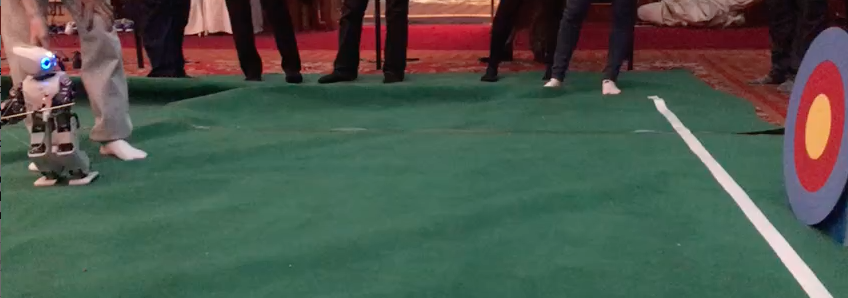
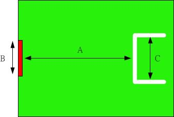

**Archery-HuroCup Laws of the Game**

Version: 14.0.3 Date: Mon Mar 27 2017 02:50:17 GMT-0600 (CST)

## HuroCup Laws of the Game

## Archery (Pro)

1Kuo-Yang Tu, ,2Jacky Baltes and 3Karla Anhel Camarillo Gomez

1Institute of Electrical Engineering

National Kaohsiung First University of Science & Technology

Kaohsiung, 811, Taiwan

[tuky@nkfust.edu.tw](tuky@nkfust.edu.tw)

2Educational Robotics Center

Department of Electrical Engineering

National Taiwan Normal University

Taipei, 10610, Taiwan

[jacky.baltes@ntnu.edu.tw](jacky.baltes@ntnu.edu.tw)

3Departamento de Ingeniería Mecánica

Robótica y Sistemas Biomecánicos

Instituto Tecnológico de Celaya

*Abstract*

*The following rules and regulations govern the archery event of HuroCup, a robotic game and robotics benchmark problem for humanoid robots.*

**Latest Version of the Rules for HuroCup**

The latest official version of the rules of the game for HuroCup is always available from the [HuroCup Facebook Page](https://www.google.com/url?q=http://www.facebook.com/groups/hurocup&sa=D&ust=1514088107603000&usg=AFQjCNGMLYX_nMp8mpc63GHxdyN9em8Z7Q).

**Archery**

The goal of the archery competition is to encourage research into humanoid robots that are able to do compliant control precisely.

**HuroCup Archery - Laws of the Game**

The following laws describe the specifics of the archery event. For general specifications relevant to all HuroCup events (e.g., robot dimensions, playing field and lighting, responsibility of the referees) please refer to [General - HuroCup Laws of the Game](https://www.google.com/url?q=https://docs.google.com/document/d/15laUlB6uZ56J5WpGPhepb7P8O7ul-8K5sgdf4uwu4Ak/pub&sa=D&ust=1514088107604000&usg=AFQjCNEECNgGWwMUepFDt2Ca_rcGDK_uHQ).

### [A-1] : Field of Play

[A-1.1] : The dimensions of the playing field are at least 400 cm by  300 cm. On one end of the playing field a target board is hanged up.  This end is called the target board side. The opposite side of the playing field is called the shooting side. See HuroCup Archery field for more details.

Dimension | Comment | Kid Size | Adult Size | Junior Size
:-|:-|-:|-:|-
$A | Distance between target board and shooting side | 150 cm | 300 cm
$B | Diameter of target board | 50 cm | 90 cm
$C | Range of shooting place | 80cm | 100 cm
$D | Height of target board center | 30cm | 90cm
$E | Diameter of small cirle | 10 cm | 30 cm
$F | Diameter of middle circle | 30 cm | 60 cm
$G | Diameter of big circle | 50 cm | 90 cm

HuroCup Archery playing field and target board

$D is the height of target board center from ground. The minimum size of the playing field is 4m by 3m.

[A-1.2] : The target board is separated into three circles in different color.  The robot shooting arrow at different circles gets different score points.

[A-1.3] : On the target board, three circles from inside to outside are 5, 3 and 1 score points, respectively.  For example, the yellow circle is 3-point zone.

[A-1.4] : The target board is soft material.  The arrows that the team prepare must be not too sharp.  For competition safety, the referees have right to ask teams to replace their arrows.

[A-1.5] : The rectangular area enclosed by white lines is the start zone.  The robot must shoot in the start zone.

[A-1.6] :   During shooting, the robot is not allowed to go outside of  the white lines of the rectangular area.

### [A-2] : The Arrows and Bow

[A-2.1] : A team may use a bow for arrow shooting.

[A-2.2] : The tip of any arrow is not allowed to be too sharp to hurt people.

[A-2.3] : Teams can put an arrow and a bow on the robot to get ready for start shooting.

### [A-3] : Number of Robots

[A-3.1] : A single robot competes in a match.

### [A-4] : The Players

[A-4.1] : Please refer to [General - HuroCup Laws of the Game](https://www.google.com/url?q=https://docs.google.com/document/d/15laUlB6uZ56J5WpGPhepb7P8O7ul-8K5sgdf4uwu4Ak/pub&sa=D&ust=1514088107618000&usg=AFQjCNGju4nhdnsT0xW0K8V7kCg6dyquYQ) for detailed information about the players.

### [A-5] : The Referee

[A-5.1] : Please refer to [General - HuroCup Laws of the Game](https://www.google.com/url?q=https://docs.google.com/document/d/15laUlB6uZ56J5WpGPhepb7P8O7ul-8K5sgdf4uwu4Ak/pub&sa=D&ust=1514088107618000&usg=AFQjCNGju4nhdnsT0xW0K8V7kCg6dyquYQ) for detailed information about the referee and his or her duties.

### [A-6] : The Assistant Referee

[A-6.1] : Please refer to [General - HuroCup Laws of the Game](https://www.google.com/url?q=https://docs.google.com/document/d/15laUlB6uZ56J5WpGPhepb7P8O7ul-8K5sgdf4uwu4Ak/pub&sa=D&ust=1514088107618000&usg=AFQjCNGju4nhdnsT0xW0K8V7kCg6dyquYQ) for detailed information about the assistant referee and his or her duties.

### [A-7] : Game Play

[A-7.1] : One robot is designated the shooter. All other robots must be positioned well away from the side of target board and must not interfere with the shooter in any way.

[A-7.2] : Each robot may have at most one human handler associated with it.

[A-7.3] : The human handlers must not interfere in any way with other robots, the referee, or other human handlers.

[A-7.4] : A human handler may only enter the playing field or touch his/her robot with the permission of the referee. The shooting will be declared invalid if the handler touches the robot without referee's permission.

[A-7.5] : At the beginning of the shooting, the shooter robot must face the target board and be directly behind the white line at a random start point.

[A-7.6] : After the shooter has been placed, the referee will select a random position inside of the start zone.  The shooter shooting out of the start zone cannot get any score point.

[A-7.7] : The shooting begins by the referee blowing a whistle. The end of the shooting is signaled by the referee by blowing the whistle a second time. The referee terminates the shooting if

1. the arrow prodded on the target board after being shot by the shooter,
2. the robot angle between the bow and the target is greater than 45 degrees or the bow and arrow is aimed in such a way that it may hit other spectators or participants,
3. the maximum duration of the competition (2 minutes) has elapsed,
4. the robot damages holder, or playing field,
5. the arrow moved outside of the playing field, or dropped down on the ground,
6. the shooter leaves the start zone or the playing field.

[A-7.8] : After the end of the shooting, another robot is designated the shooter.

[A-7.9] : The designated shooter must stand up in the start zone to get ready for its shooting in 1 minutes.  Otherwise the referee has right to make the decision that the shooter give up this round.

### [A-8] : Method of Scoring

[A-8.1] : There are five rounds in the competition.

[A-8.2] : A robot scores if the arrow prods on the target board.  The score points got by the robot are dependent on the arrow prodded the position of the target point.  For example, if the arrow is prodded at 5-point circle, then the robot get 5 points.

[A-8.3] : Any robot that has not scored a single point is automatically awarded 0 rank.

[A-8.4] : Among the robots that have scored at least one point, the robots are ranked (i.e., 1st place, 2nd place) based on the greater number of points that the robot scored.

[A-8.5] : For more details about the point allocation, please refer to [Point Allocation [Organization - HuroCup Laws of the Game]](https://www.google.com/url?q=https://docs.google.com/document/d/1kn2_dtNp65n1j5TjZWJVIlTKRFcNkTSpARkdhLHNA1c/edit%23bookmark%3Did.rzzlothp76e9&sa=D&ust=1514088107623000&usg=AFQjCNEJ6OhF0kSidOz6BwJlCXYxdiak2w).

### [A-9] : Tiebreaker

[A-9.1] : In case of a tie, i.e., more than one robot having scored the same number of points, the robots will be ranked based on the sum of their score point over all rounds.

[A-9.2] : In case one or more robots have scored the same number of points and are still tied after applying the previous tiebreaker, the maximum score points in a single round will be used to break the tie.
