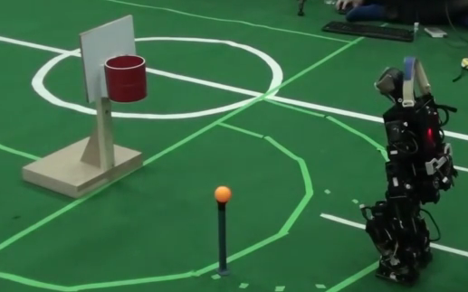
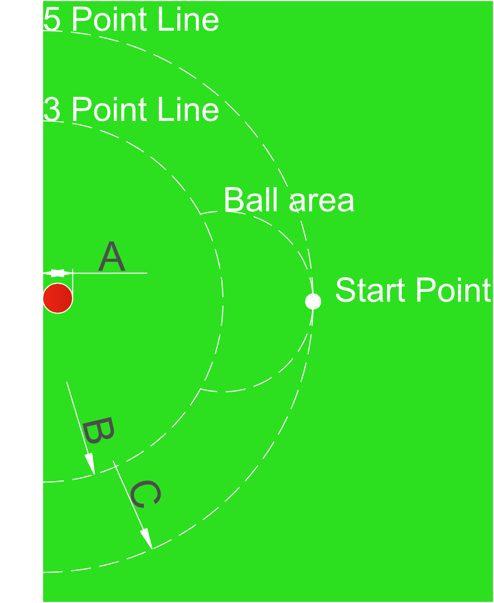
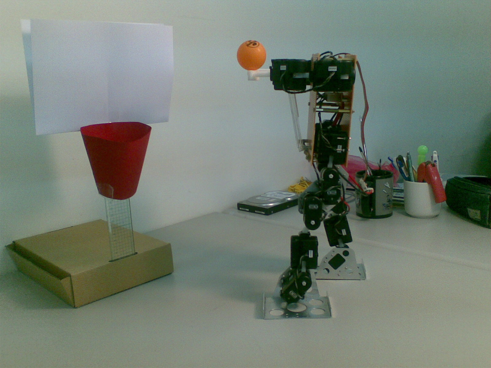
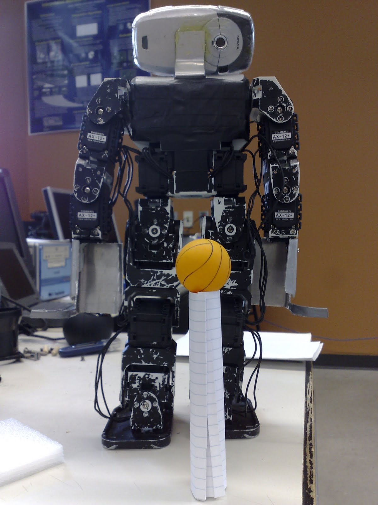

Jacky Baltes

Educational Robotics Center

Department of Electrical Engineering

National Taiwan Normal University

Taipei, 10610, Taiwan

[jacky.baltes@ntnu.edu.tw](jacky.baltes@ntnu.edu.tw)

     

*Abstract*

*The following rules and regulations govern the basketball event of HuroCup, a robotic game and robotics benchmark problem for humanoid robots.*

##Latest Version of the Rules for HuroCup

The latest official version of the rules of the game for HuroCup is always available from the [HuroCup Facebook Page](https://www.google.com/url?q=http://www.facebook.com/groups/hurocup&sa=D&ust=1513950733849000&usg=AFQjCNHtSJhrd2PLygT9mRg8qv_vqP_BXg).
##Changes to the Basketball rules of HuroCup

There are no significant changes to the laws of the game for basketball in the 2015 competition.

##Basketball

The goal of the basketball competition is to encourage research into humanoid robots that are able to dexterously manipulate small objects.
##HuroCup Basketball - Laws of the Game

The following laws describe the specifics of the basketball event. For general specifications relevant to all HuroCup events (e.g., robot dimensions, playing field and lighting, responsibility of the referees) please refer to [General - HuroCup Laws of the Game.](https://www.google.com/url?q=https://docs.google.com/document/d/15laUlB6uZ56J5WpGPhepb7P8O7ul-8K5sgdf4uwu4Ak/pub&sa=D&ust=1513950733850000&usg=AFQjCNE6e6xU_TO4qjLMIAER5Lbp-cThXA)
**[BB-1]: Field of Play**

[BB-1.1]: The dimensions of the playing field are at least 400 cm by  300 cm. On one end of the playing field a basket is mounted. This end is called the basket side. The opposite side of the playing field is called the empty side. See [HuroCup Basketball field](https://docs.google.com/document/d/14nGPXJio0P49PecHr4EyEZewPgMYz9ZPp0Qbfq3g5HE/pub#id.vkvs9mqwwz4e) for more details.

<table>
 <table>
 <tr>
     
 </tr>
</table>

<table>
  <tr>
    <th width=20%, bgcolor=yellow >Dimension</th>
    <th width=20%, bgcolor=yellow>Comment</th>
    <th width="20%", bgcolor=yellow>Kid Size</th>
    <th width="20%", bgcolor=yellow>Adult Size</th>
    <th width="50%", bgcolor=yellow>U19 Size</th>
  </tr>
  <tr>
    <td > $A </td>
    <td > Radius of Basket</td>
    <td align = right> 5cm </td>
    <td align="right"> 15cm </td>
    <td align="right" > 5cm</td>
  </tr>
  <tr>
    <td > $B</td>
    <td> Radius 3 Point Line </td>
    <td align="right"> 60cm</td>
    <td align="right">  100cm</td>
    <td align="right">  60cm</td>
  <tr>
    <td >$C </td>
    <td> Radius 5 Point Line </td>
    <td align="right"> 90cm </td>
    <td align="right">  150cm</td>
    <td align="right">  90cm</td>
  </tr>
  <tr>
    <td > $D </td>
    <td > Radius Ball Area </td>
    <td align="right">  30cm</td>
    <td align="right">  50cm</td>
    <td align="right">On line from robot to basket  </td>
 </tr>
 <tr>
    <td >  $E</td>
    <td > Length of Basket  </td>
    <td align="right"> 10cm </td>
    <td align="right">  20cm</td>
    <td align="right"> 10cm </td>
 </tr>
 <tr>
    <td > $F </td>
    <td > Height of Basket RIm  </td>
    <td align="right"> 40cm </td>
    <td align="right">  80cm</td>
    <td align="right">  40cm</td>
 </tr>
    * *
 <tr>
    <td > $G </td>
    <td > Backboard  </td>
   
    <td align="right">  20cm\*20cm</td>
    
    <td align="right">  40cm\*40cm</td>

    <td align="right">  20cm\*20cm</td>
 </tr>
</table>

<table>
<tr>
    <td width="100%", bgcolor=yellow>*HuroCup Basketball field

    Dashed lines are implicit lines that may not be visible to the robot. The minimum size of the playing field is 2m by 2m.*</td>
</tr>
 </table>
</table>

[BB-1.2]: The basket is mounted in the centre of the basket side.

[BB-1.3]: A circle centred in the middle of the basket side with a radius $B forms the 3 point throw line.

[BB-1.4]: A circle centred in the middle of the basket side with a radius $C forms the 5 point throw line.

[BB-1.5]: The start point for the robots is distance $C away from the centre of the basket side.

[BB-1.6]: The ball zone is constructed by drawing a circle centered in front of the basket and distance B away from the basket side. The radius of the circle is $D=$C - $B. The ball zone is the area that is inside of this circle, but outside of the 3 point line.
**[BB-2]: The Ball, Basket, and Holder**

[BB-2.1]: The ball for the kid sized robot is a white or orange table tennis ball. The ball for the adult sized robots is a yellow tennis ball. Figure [Robot and Basket for HuroCup Basketball](https://docs.google.com/document/d/14nGPXJio0P49PecHr4EyEZewPgMYz9ZPp0Qbfq3g5HE/pub#id.6geuxxfon87b) shows a possible setup for the kid sized robots.

[BB-2.2[: The basket is a red coloured cup with an approximate radius $A. The length of the basket is approximately $E.

[BB-2.2]: The top rim of the basket is mounted at an approximate height $F.

[BB-2.3]: A white backboard with size $G is mounted behind the basket. The lower edge of the backboard is approximately level with the rim of the basket.

<table>

<table>
<tr>
    
</tr>
</table>

<table>
<tr>
 <td width="10%", bgcolor=yellow>*Robot and Basket for HuroCup Basketball*</td>
</tr>
</table>

</table>
[BB-2.4]: A team may use a ball holder to lift the ball of the ground. The diameter of the ball holder must be less than ½ of the diameter of the ball. The construction of the ball holder must not help the robot in any way in localizing itself or the ball. See Robot and Ball Holder for an example.

<table>

<table>
<tr>
    
</tr>
</table>

<table>
<tr>
<td width="10%", bgcolor=yellow>*Robot and Ball Holder*</td>
</tr>
</table>

</table>

**[BB-3]: Number of Robots**

[BB-3.1]: A single robot competes in a match.

**[BB-4]: The Players**

[BB-4.1]: Please refer to [General - HuroCup Laws of the Game](https://www.google.com/url?q=https://docs.google.com/document/d/15laUlB6uZ56J5WpGPhepb7P8O7ul-8K5sgdf4uwu4Ak/pub&sa=D&ust=1513950733867000&usg=AFQjCNGf7LrlUaJvoDY-kp--oxy5dSOeng) for detailed information about the players.

**[BB-5]: The Referee**

[BB-5.1]: Please refer to [General - HuroCup Laws of the Game](https://www.google.com/url?q=https://docs.google.com/document/d/15laUlB6uZ56J5WpGPhepb7P8O7ul-8K5sgdf4uwu4Ak/pub&sa=D&ust=1513950733868000&usg=AFQjCNFvREkYZrA7ia0C_ZZANOO_vGTfUw) for detailed information about the referee and his or her duties.
**
[BB-6]: The Assistant Referee**

[BB-6.1]: Please refer to [General - HuroCup Laws of the Game](https://www.google.com/url?q=https://docs.google.com/document/d/15laUlB6uZ56J5WpGPhepb7P8O7ul-8K5sgdf4uwu4Ak/pub&sa=D&ust=1513950733869000&usg=AFQjCNGjBsXuAo8p77an9BTDRFYtsbBqEA) for detailed information about the assistant referee and his or her duties.

**[BB-7]: Game Play**

[BB-7.1]: One robot is designated the thrower. All other robots must be positioned well away from the basket side and must not interfere with the thrower in any way.

[BB-7.2]: Each robot may have at most one human handler associated with it.

[BB-7.3]: The human handlers must not interfere in any way with other robots, the referee, or other human handlers.

[BB-7.4]: A human handler may only enter the playing field or touch his/her robot with the permission of the referee. The throw will be declared invalid if the handler touches the robot.

[BB-7.5]: The thrower must be directly behind the start point facing the basket at the beginning of the throw.

[BB-7.6]: After the thrower has been placed, the referee will select a random position inside of the ball zone. If a team wishes to use an approved ball holder, the ball will be placed on the holder, otherwise the ball will be placed on the ground at the selected location.

[BB-7.7]: The throw begins by the referee blowing a whistle. The end of the throw is signaled by the referee by blowing the whistle a second time. The referee terminates the throw if

1. the ball entered the basket after being thrown by the thrower,
2. the maximum duration of the competition (2 minutes) has elapsed,
3. the robot damages or moves the basket, holder, or playing field,
4. the ball moved outside of the playing field,
5. a robot leaves the playing field.

[BB-7.8]: After the end of the throw, another robot is designated the thrower.

**[BB-8]: Method of Scoring**

[BB-8.1]: There are five rounds in the competition.

[BB-8.2]: The three point cylinder is the volume of space described by the playing field as the base and extruding the three point circle as sides.

[BB-8.3]: The five point cylinder is the volume of space described by the playing field as the base and extruding the five point circle as sides.

[BB-8.4]: A robot scores if the ball enters the basket. If the whole body of the robot was outside of the five point cylinder, then the robot will receive five points. Otherwise, if the whole body of the robot was outside of the three point cylinder, then the robot will receive three points. If any part of the robot was inside of the three point cylinder, the robot will receive two points.

[BB-8.5]: Any robot that has not scored a single point is automatically awarded 0 rank.

[BB-8.6]: Among the robots that have scored at least one point, the robots are ranked (i.e., 1st place, 2nd place) based on the greater number of points that the robot scored.

[BB-8.7]: For more details about the point allocation, please refer to [Point Allocation [Organization - HuroCup Laws of the Game]](https://www.google.com/url?q=https://docs.google.com/document/d/1kn2_dtNp65n1j5TjZWJVIlTKRFcNkTSpARkdhLHNA1c/edit%23bookmark%3Did.rzzlothp76e9&sa=D&ust=1513950733872000&usg=AFQjCNE8HQ1UiJGOUW-Xh_Y2tmvt_cZq8A).

**[BB-9]: Tiebreaker**

[BB-9.1]: In case of a tie, i.e., more than one robot having scored the same number of points, the robots will be ranked based on the sum of their ball scores over all rounds.

[BB-9.2]: In case one or more robots have scored the same number of points and are still tied after applying the previous tiebreaker, the maximum ball score in a single round will be used to break the tie.

