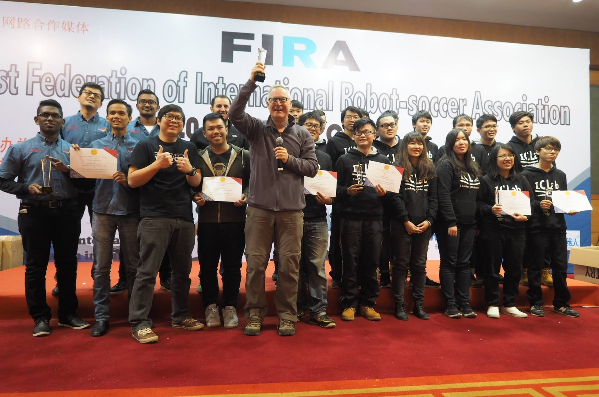
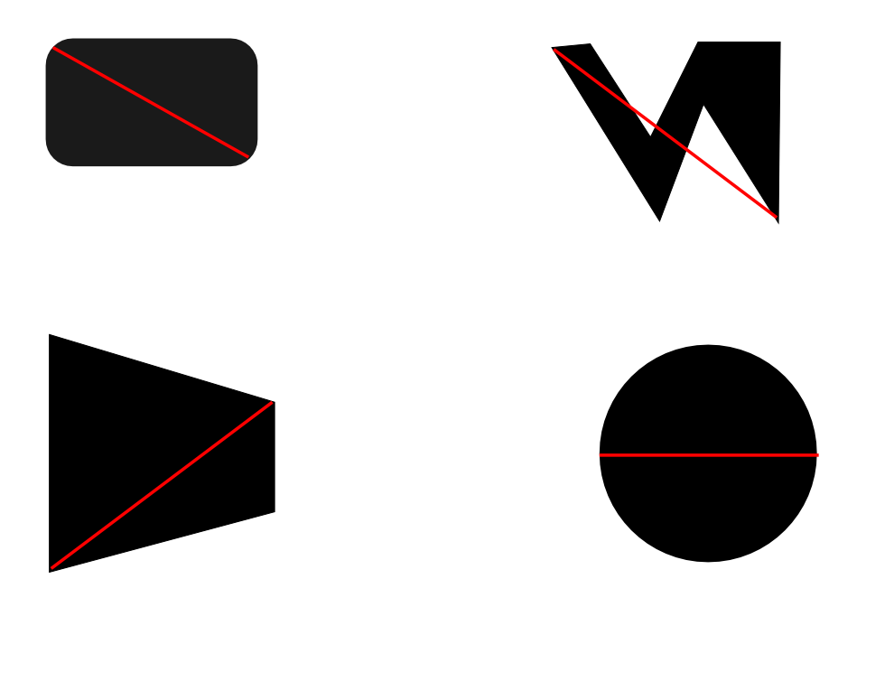

Jacky Baltes

Educational Robotics Center

Department of Electrical Engineering

National Taiwan Normal University

Taipei, 10610, Taiwan

[jacky.baltes@ntnu.edu.tw](jacky.baltes@ntnu.edu.tw)

*Abstract*

*The following rules and regulations are general rules of HuroCup, a robotic game and robotics benchmark problem for humanoid robots. The HuroCup competition emphasizes the development of flexible, robust, and versatile robots that can perform many different tasks in different domains.  HuroCup encourages research into the many areas of humanoid robotics, especially walking and balancing, complex motion planning, and human robot interaction. In addition to the single events (e.g., archery, sprint, marathon, united soccer, obstacle run, long jump, spartan race, marathon, weightlifting, and basketball), there is an all-round competition for the single robot that performs best over all events.*

##Latest Version of the Rules for HuroCup

The latest official version of the rules of the game for HuroCup is always available from the [HuroCup Facebook Page.](https://www.google.com/url?q=http://www.facebook.com/groups/hurocup&sa=D&ust=1514130922371000&usg=AFQjCNF88GqMLVbEBQqczVzRylYrlQYbzQ)
##Changes to the General Rules of HuroCup

There are no significant changes to the general rules of HuroCup in the 2015 competition.
##Mission Statement

The goal of the HuroCup league is to encourage research in practical, autonomous, highly mobile, flexible, and versatile robotic platforms. Intended applications for these robots are, among others, search and rescue robots, healthcare robots, intelligent household helper robots, etc.

As a benchmark problem, the goal of the HuroCup league is to develop humanoid robots that can perform several tasks in complex environments.
##Physical Challenge Events

To reduce the steep learning curve toward fully autonomous humanoid robots, the rules committee has developed several challenge events for the different leagues.

These challenges are aimed at providing intermediate goals on the path to fully autonomous robots that can operate in challenging environments.

The following subsections describe each individual event briefly. These challenges are conducted using the corresponding laws for equivalent human events as much as possible. For example, the United Soccer laws are based on the FIFA Laws of the Game. See [Laws of the Game](https://docs.google.com/document/d/15laUlB6uZ56J5WpGPhepb7P8O7ul-8K5sgdf4uwu4Ak/pub#id.mw3kjcu13jii) for more details. Unless otherwise specified, the laws of the corresponding human equivalent game apply.

**Basketball**

The basketball competition is a single robot event at the moment, but will be expanded to multiple players in the future. The robot must throw a ball into a coloured target. For detailed rules of the basketball event please refer to [Basketball - HuroCup Laws of the Game](https://www.google.com/url?q=https://docs.google.com/document/d/14nGPXJio0P49PecHr4EyEZewPgMYz9ZPp0Qbfq3g5HE/pub&sa=D&ust=1514130922373000&usg=AFQjCNF40R8c9v77B1kjc9fZC3JVnLA9Bw).

**Spartan Race (To merge Lift & Carry and Climbing Wall)**

The Spartan Race competition is the challenge for humanoid robot mobility.  The goal of mobility competition is to provide an event that requires robot to move using legs or hands in challenge environment. The detailed rules for the mobility competition are given in [Spartan Race - HuroCup Laws of the Game](https://www.google.com/url?q=https://docs.google.com/document/d/1mh1xXGr970a3S0qakOopx7g8n-JDd2HS7DaYFoopPfo/edit?usp%3Dsharing&sa=D&ust=1514130922374000&usg=AFQjCNF-JWfBaYWqey-a3m9KVwgESKKGfA)

**Archery**

The goal of the Archery competition is to provide an event that requires robots to control arms precisely and accurately.  For detailed rules of the lift and carry competition please refer to the document [Archery - HuroCup Laws of the Game](https://www.google.com/url?q=https://docs.google.com/document/d/1Vw3d7PTQD5_KZzCgdRNJrrkNQ9bXQGFf2iCc136tKdo/edit?usp%3Dsharing&sa=D&ust=1514130922375000&usg=AFQjCNGal9n2ZGliJV6FMvzpRs9EeM4YQA).

**Long Jump**

The goal of the Long Jump competition is to provide an event that requires the development of highly dynamic robots with enough flexibility to land without damage. For detailed rules of the long jump competition, please refer to the document [Long Jump - HuroCup Laws of the Game](https://www.google.com/url?q=https://docs.google.com/document/d/1eNKoKVrOe-rQkWAM51IBClWYoIAtyyjrTyqxc2hsdXM/pub&sa=D&ust=1514130922376000&usg=AFQjCNGaAcP96Aoso5cInREIZJphFDcsBg).

**Marathon**

The marathon event is an endurance race over an extended distance, where robots are not allowed to switch their batteries. The robots follow a coloured track. For detailed rules of the marathon event please refer to the document titled [Marathon - HuroCup Laws of the Game](https://www.google.com/url?q=https://docs.google.com/document/d/1mC2gLOjVYGabGnAS96kaOjltj17cigHKygP_nKmUC_M/pub&sa=D&ust=1514130922376000&usg=AFQjCNGT5PipxzuLRbEYK_UO08HADUo1Gg).

**Obstacle Run**

In the obstacle run, the robot must move as quickly as possible from one side of the playing field to the other. The playing field includes various obstacles that the robot must overcome. The setup of the obstacles is unknown to the robot before the start of the event. For detailed rules on the obstacle run event, please refer to [Obstacle Run - HuroCup Laws of the Game](https://www.google.com/url?q=https://docs.google.com/document/d/1JF4hpEZ4fg_3BNnBojY3ZAYBdgUDpfGaB_MJusSJ5-8/pub&sa=D&ust=1514130922377000&usg=AFQjCNHL0Xspwr4SPZIhdEXYo0PGSkyQzA).

**Penalty Kick**

In this event, the robot must dribble a ball passed a set of static simulated opponents and then kick it into the goal defended by a static goal keeper. For detailed rules of the penalty kick event, please refer to [Penalty Kick - HuroCup Laws of the Game](https://www.google.com/url?q=https://docs.google.com/document/d/1UTIKr7srnCQOHYG_Zr4AaGlk8rLRkweH8U6f49gTiE8/pub&sa=D&ust=1514130922378000&usg=AFQjCNE6CW0ttIjh0EdGZm6iCL1y_zCgqw). This event is limited to adult sized robots.

**Sprint**

The sprint event (formerly named robot dash event) is a short distance maximum speed race for humanoid robots. The goal is for the robots to move as quickly as possible from a start line to the end line for a series of segments. For detailed rules of the robot sprint event, please refer to [Sprint - HuroCup Laws of the Game](https://www.google.com/url?q=https://docs.google.com/document/d/1kzxZ4RmEa3PCHcBy6m6-ZVowqGwvkFNgTQ8emGHcTk0/pub&sa=D&ust=1514130922379000&usg=AFQjCNH_EYHbbkHkxAOJEAWjCk9HTYM-DQ)

**United Soccer**

The soccer competition is an event that focuses on robot to robot interaction and collaboration. Teams of robots are randomly selected and compete in soccer matches against each other. For detailed rules of the soccer united competition please refer to the document titled United [Soccer - HuroCup Laws of the Game](https://www.google.com/url?q=https://docs.google.com/document/d/1elCnLnx1FiY1y7RCQj_xvlb7qvBFCJsCyqTcdDTfA4Y/pub&sa=D&ust=1514130922379000&usg=AFQjCNH56-kLwUdWHlwh7XhB7MlWcijWLQ). Several passing markers are placed on the playing field. This event is limited to kid sized robots at the moment.

**Weight Lifting**

The goal of the weight lifting event is to develop robots that can lift and balance heavy weights. For detailed rules of the weight lifting event please refer to [Weightlifting - HuroCup Laws of the Game](xxx).

##Laws of the Game

The following section describes the general law of the game for all HuroCup events. It is based on the rules of similar robotic and human games (e.g., FIRA, RoboCup, and FIFA).   

####[GN-1]: **Leagues**

The HuroCup competition consists of two separate leagues: HuroCup Senior and HuroCup Junior.

[GN-1.1]: The HuroCup Senior league is open to all participants independent of age, educational level, or profession.

[GN-1.2]: The HuroCup Junior league competition is limited to high school students. A HuroCup Junior team may include a team official who may be an adult. With the exception of the team official, who shall not help the students in the development of their robot, all members of a HuroCup Junior league team must be high school, junior high school, or elementary school students or the equivalent school level in the country of origin of the team. The HuroCup Junior league competition is only open to kid sized robots.

###[OG-2]: HuroCup Events

[GN-1.3]: The HuroCup competition includes the following events: basketball, marathon, archery, long jump, obstacle run, sprint, united soccer/penalty kick, spartan race, mini-drc, and weightlifting.

[GN-1.4]: The HuroCup Junior competition includes the following events: mini-drc, wall climbing, marathon, sprint, and weightlifting.

####**[GN-2]: The Players**

<table>
  <tr>
    <th width=20%, bgcolor=yellow >Dimension</th>
    <th width=20%, bgcolor=yellow>Comment</th>
    <th width="20%", bgcolor=yellow>Kid Size</th>
    <th width="20%", bgcolor=yellow>Adult Size</th>
    <th width="50%", bgcolor=yellow>U19 Size</th>
  </tr>
  <tr>
    <td > $H </td>
    <td >Maximum Height</td>
    <td align = right> 60cm </td>
    <td align="right"> 180cm </td>
    <td align="right" > 60cm</td>
  </tr>
  <tr>
    <td > $HM</td>
    <td>Minimum Height </td>
    <td align="right"> 0cm</td>
    <td align="right">  80cm</td>
    <td align="right">  0cm</td>
  <tr>
    <td >$G </td>
    <td> Maximum Weight </td>
    <td align="right"> 20cm </td>
    <td align="right">  50cm</td>
    <td align="right">  20cm</td>
  </tr>
  <tr>
    <td > $D </td>
    <td > Maximum foot dimension </td>
    <td align="right">  12cm</td>
    <td align="right">  32cm</td>
    <td align="right">  15cm </td>
 </tr>
 <tr>
    <td >  $AL</td>
    <td > Maximum arm length </td>
    <td align="right"> Arms must not reach below the knees while standing</td>
    <td align="right">  Arms must not reach below the knees while standing</td>
    <td align="right"> Arms must not reach below the knees while standing</td>
 </tr>

</table>

[GN-2.1]: The game is played using humanoid robots[1]. The maximum size of the robots is $H. The maximum weight of the robot is $G.

[GN-2.2]: There are two categories of robots (kid and adult-sized) depending on their height and the maximum foot dimension.

[GN-2.3]: The height $H of the robot is defined as the maximum distance between any part of the robot, excluding its arms,  and the ground when the robot is fully extended.

[GN-2.4]: The maximum foot dimension $D is defined as the maximum distance of any two points on any foot of the robot. Some examples are shown in the [Fig. Max. Foot Dimension](https://docs.google.com/document/d/15laUlB6uZ56J5WpGPhepb7P8O7ul-8K5sgdf4uwu4Ak/pub#id.we3thfqzq7hx)

*Fig. Max. Foot Dimension*

[GN-2.5]: The length of the arms must be limited such that they cannot reach below the knees when the robot is in a standing posture.

[GN-2.6]: The robot must be limited in its kinematics to actions that are equivalent to human kinematics.

[GN-2.7]: The sensors on the robot must be equivalent to human senses of sight, sound, touch, hearing, taste, proprioception, balance, and acceleration.

[GN-2.8]: All sensors must be passive, that is they are not allowed to emit signals such as infrared, ultrasound, or laser pulses.

[GN-2.9]: The mode of locomotion of the robot must be bipedal walking or running.

[GN-2.10]: Each robot must have the ability of fully independent locomotion, sensing, and processing. That is, all actuators, motors, power, computing, and sensing mechanisms must be incorporated into the robot.

[GN-2.11]: Each robot must be fully autonomous, that is, it must perform its own control decisions.

[GN-2.12]: Robots may use black and white coloring without restriction. Other colors may be used so long as they are deemed by the rules committee to be sufficiently different from reserved colors, specifically ball yellow, marker red and marker blue.

[GN-2.13]: A robot must not have in its construction anything that is dangerous to itself, another robot, human operators, or spectators.

[GN-2.14]: In the event of an infringement of this law: 

1.    play must be stopped,
2.    the offending robot as identified by the referee must be removed from the playing field by its handler,
3.    the robot may then be repaired and the fault identified by the referee may be corrected by the team (play will continue during this time),
4.    the repaired robot may not re-enter the field without the referee’s permission,
5.    the referee verifies that the fault has been repaired before allowing the robot to re-enter the field,
6.    the robot may only re-enter the field during a stoppage in play.

####**[GN-3]: The Referee**

[GN-3.1]: Every event or match is controlled by a referee who has full authority to enforce the Laws of the Game in connection with the match to which he or she has been appointed.

[GN-3.2]: The referee enforces the Laws of the Game.

[GN-3.3]: The referee controls the event possibly in cooperation with the assistant referee.

[GN-3.4]: The referee ensures that any equipment used meets the requirements of the respective laws of the game.

[GN-3.5]: The referee ensures that the robotic equipment meets the requirements of [The Players](https://docs.google.com/document/d/15laUlB6uZ56J5WpGPhepb7P8O7ul-8K5sgdf4uwu4Ak/pub#id.8ezok8j6zj1u).

[GN-3.6]: The referee stops, suspends or terminates the event, at his discretion, for any infringements of the Laws.

[GN-3.7]: The referee stops, suspends or terminates the match because of outside interference of any kind.

[GN-3.8]: The referee stops the event if, in his opinion, a robot is likely to cause serious harm to humans, other robots or itself and ensures that it is removed from the field of play.

[GN-3.9]: The referee punishes the more serious offense when a robot commits more than one offense at the same time.

[GN-3.10]: The referee takes disciplinary action against robots guilty of cautionable and sending-off offenses. He is not obliged to take this action immediately but must do so during the next stoppage in play.

[GN-3.11]: The referee acts on the advice of assistant referees regarding incidents which he has not seen.

[GN-3.12]: The referee ensures that no unauthorized persons enter the field of play.

[GN-3.13]: The referee restarts the match after it has been stopped.

[GN-3.14]: The referee provides the appropriate authorities with a match report which includes information on any disciplinary action taken against team officials and any other incidents which occurred before, during or after the match.

[GN-3.15]: The referee allows play to continue when the team against which an offense has been committed will benefit from such an advantage and penalizes the original offense if the anticipated advantage does not ensue at that time.

[GN-3.16]: The referee takes action against team officials who fail to conduct themselves in a responsible manner and may at his discretion, expel them from the field of play and its immediate surroundings.

[GN-3.17]: The decisions of the referee regarding facts connected with play are final.

[GN-3.18]: The referee may only change a decision on realizing that it is incorrect or, at his discretion, on the advice of an assistant referee, provided that he or she has not restarted play.

[GN-3.19]: A referee, assistant referee, or other official such as time keeper is not held liable for:

1.    kind of injury suffered by an official or spectator,
2.    any damage to property of any kind,
3.    any other loss suffered by any individual, club, company, association or other body, which is due or which may be due to any decision which he or she may take under the terms of the Laws of the Game or in respect of the normal procedures required to hold, play and control an event. 

This may include:

1.    a decision that the condition of the field of play or its surroundings are such as to allow or not to allow an event to take place,
2.    a  decision to abandon an event for whatever reason,
3.    a decision as to the condition of the fixtures or equipment used during an event,
4.    a decision to stop or not to stop a match due to spectator interference or any problem in the spectator area,
5.    a decision to stop or not to stop play to allow a damaged robot to be removed from the field of play for repair,
6.    a decision to request or insist that a damaged robot be removed from the field of play for repair,
7.    a decision to allow or not to allow a robot to have certain colors,
8.    a decision (insofar as this may be his responsibility) to allow or not to allow any persons (including team or stadium officials, security officers, photographers or other media representatives) to be present in the vicinity of the field of play,
9.    any other decision which he or she may take in accordance with the Laws of the Game or in conformity with the duties of a referee under the terms of the HuroCup FIRA Federation or league rules or regulations under which the event is played.

####**[GN-4]: The Assistant Referee**

[GN-4.1]: The duties of the appointed assistant referees, subject to the decision of the referee, are to

1.    act as timekeepers and keep a record of the event,
2.    monitor the robot operators for illegal signals being sent to the robots,
3.    indicate when an interchange is requested,
4.    indicate when misconduct or any other incident has occurred out of the view of the referee,
5.    indicate when offenses have been committed whenever the assistant referees are in a better position than the referee to observe the offence,

[GN-4.2]: The assistant referees also assist the referee to control the match in accordance with the Laws of the Game. In the event of undue interference or improper conduct, the referee will relieve an assistant referee of his duties and make a report to the appropriate authorities.

