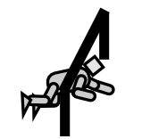
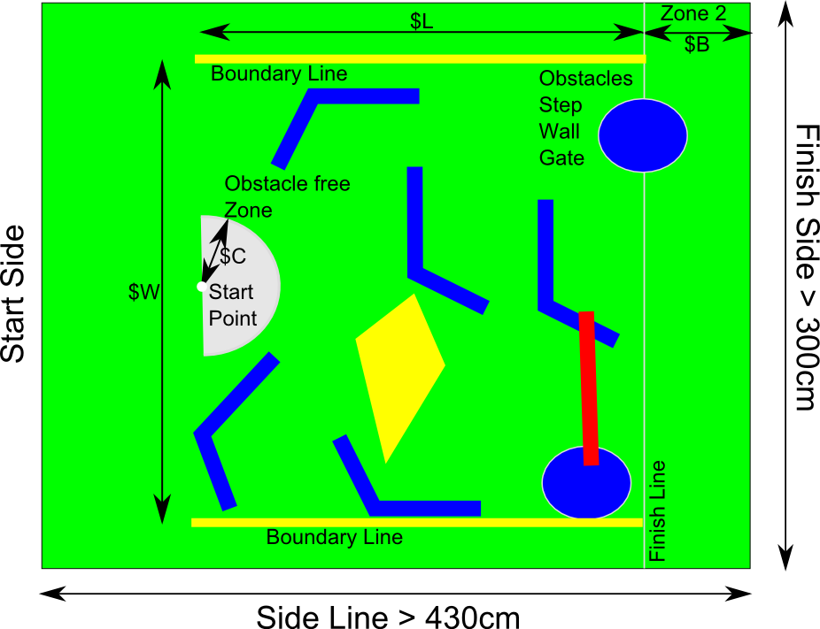
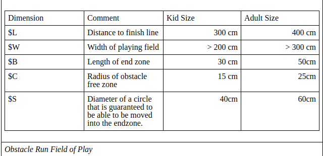
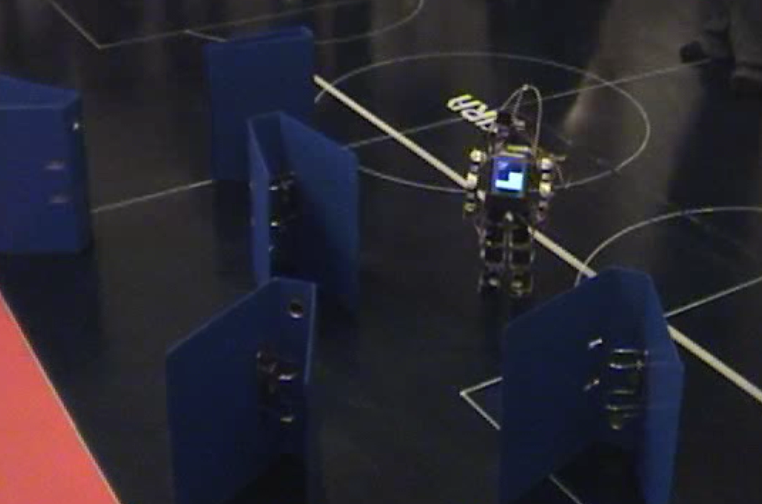
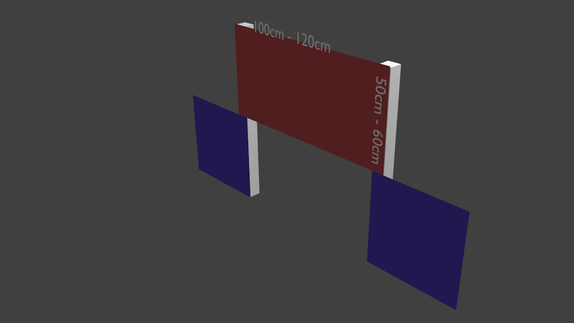

Version: 14.0.3 Date: Thu Dec 22 2016 10:43:57 GMT+0800 (HKT)

  

># HuroCup Laws of the Game  
># Obstacle Run

Jacky Baltes  
Educational Robotics Center  
Department of Electrical Engineering  
National Taiwan Normal University, Taipei, 10610, Taiwan  
  
Abstract  
The following rules and regulations govern the obstacle run event of HuroCup, a robotic game and robotics benchmark problem >for humanoid robots.

## Latest Version of the Rules for HuroCup  
The latest official version of the rules of the game for HuroCup is always available from the HuroCup Facebook Page.

## Changes to the Obstacle Run rules of HuroCup 
The robot can carry batteries will be awarded more points.  There will be at least three rounds in an event, where the robot must crawl underneath the gate obstacle to reach the goal. 

## Obstacle Run
In the obstacle run challenge, the robot must move from one end of the playing field to the other as quickly as possible. There are three types of obstacles in the environment: (a) hole obstacles that simulate holes in the floor, (b) wall obstacles which can not be overcome, and (c) gate obstacles that a sufficiently mobile robot can overcome by crawling under them.

## HuroCup Obstacle Run - Laws of the Game
The following laws describe the specifics of the obstacle run event. For general specifications relevant to all HuroCup events (e.g., robot dimensions, playing field and lighting, responsibility of the referees) please refer to General - HuroCup Laws of the Game.

## [OR-1]: Field of Play  
[OR-1.1] : The dimensions of the playing field are at least 300 cm by 400 cm.  
[OR-1.2] : There is a finish line marked on one side of the playing field. This side of the playing field is called the finish side. The opposite side of the playing field is called the start side. The two other sides are called side lines. The field of play is shown in Obstacle Run Field of Play.  
  

  
[OR-1.3] : The start points are approximately in the center of the playing field and indicated by the referee.  
[OR-1.4] : The distance between the start point and the finish line is $L.  
[OR-1.5] : There is a $B long zone behind the finish line, which is called the end zone.  

## [OR-2]: Obstacles  
[OR-2.1] : A hole obstacle is an obstacle on the playing field. The shape and size of the hole obstacles is undefined. The colour of a hole obstacle is yellow.  
[OR-2.2] : A wall obstacle is an obstacle that is placed on the floor and has a height of approximately 30cm. It has a minimum length of 40cm. The colour of a wall obstacle is blue (see Wall and Gate Obstacles).  
[OR-2.3] : A gate obstacle is an obstacle that is placed at a height of approximately 30cm. It has a minimum length of 50cm. The colour of a gate obstacle is red (see Wall and Gate Obstacles).  
  
  
Wall and Gate Obstacles  
[OR-2.4] : The referee or a person designated by the referee places at least five wall obstacles, one gate, and one hole obstacle at random positions in the playing field.  
[OR-2.5] : The obstacles will be placed using the following constraints: (a) a circular region with a radius of at least $C around the starting point is free of obstacles, (b) at least one of the obstacles shall be in the direct path of the robot to the finish line, (c ) there is at least one free walkable path from the start point to the finish line. That is, a circle with a diameter of $S can be moved from the start point to the finish line without touching any obstacle or passing underneath or over any of the obstacles. Note that this does not imply that the minimum distance between two obstacles is at least $S. Some obstacles may be closer together than $S as can be seen in Obstacle Run Field of Play.  
[OR-2.6] : At least two runs in each round will be placed in such a way that the only path that is guaranteed to be free for a circle of diameter $S will lead under the gate.  

## [OR-3]: Number of Robots
[OR-3.1] : A single robot competes in a match.

## [OR-4]: The Players
[OR-4.1] : Please refer to General - HuroCup Laws of the Game for detailed information about the players.

## [OR-5]: The Referee
[OR-5.1] : Please refer to General - HuroCup Laws of the Game for detailed information about the referee and his or her duties.

## [OR-6]: The Assistant Referee
[OR-6.1] : Please refer to General - HuroCup Laws of the Game for detailed information about the assistant referee and his or her duties.

## [OR-7]: Game Play  
[OR-7.1] : A single robot is designated the runner. All other robots must be outside of the playing field.  
[OR-7.2] : The only robot allowed to move during a run is the designated runner.  
[OR-7.3] : Each robot may have at most one human handler associated with it.  
[OR-7.4] : The human handlers are not allowed to interfere in any way with other robots, the referee, or other human handlers.  
[OR-7.5] : A human handler may only enter the playing field or touch his/her robot with the permission of the referee.  
[OR-7.6] : At the beginning of the competition, the designated runner must be at the start point. The runner must face forward towards the finish line.  
[OR-7.7] : After the robot has been placed, the obstacles will be distributed by the referee.  
[OR-7.8] : The referee will signal the start of the competition by blowing the whistle.  
[OR-7.9] : A robot has crossed the finish line when both feet of the robot completely cross the finish plane and touch the ground in the end zone. The finish plane is the plane which intersects the playing field at a 90 degree angle at the back of the finish line.  
[OR-7.10] : The handler shall remove his/her assigned robot as soon as possible from the end zone after it has crossed the finish line.  
[OR-7.11] : The end of the competition is signaled by the referee by blowing the whistle a second time. The referee terminates the competition if  
+ either the robot has successfully crossed the finish line,
+ or the maximum duration of the competition (three minutes) has elapsed.
+ or the robot is immobilized by a technical defect,
+ or the robot leaves the playing field,
+ or the robot touches one of the wall, hole, or gate obstacles (In case the obstacle was moved by the robot, the obstacle + + will be repositioned by the referee).  
[OR-7.12]: At the end of the run, another robot will be designated the runner.  

## [OR-8]: Method of Scoring
[OR-8.1] : There are five tries in one round of the competition. Each try consists of all robots being designated the runner exactly once. Each robot receives one point for each try in which it manages to cross the finish line.  
[OR-8.2] : Any robot that has not reached the finish line at least once is automatically awarded no rank and 0 points.  
[OR-8.3] : Among the robots that have reached the finish line at least once, the robots are ranked (i.e., 1st place, 2nd place) based on the greater number of successful runs.  
[OR-8.4] : In case of a tie, i.e., more than one robot having scored the same number of runs, the robots will be ranked based on the total time required to complete all successful runs.  
[OR-8.5]: For more details about the point allocation, please refer to Point Allocation [Organization - HuroCup Laws of the Game].  

## [OR-9]: Tiebreaker  
[OR-9.1] : In case two or more robots have the same number of points after all rounds in the obstacle run event, the sum of the successful tries will be used a tiebreaker.  
[OR-9.2]: In case two or more robots have the same number of points after all rounds and are still tied after applying the previous tiebreaker, the maximum number of successful runs in a single round will be used as tiebreaker.  
[OR-9.3]: In case two or more robots are still tied after applying the previous tiebreaker, the time for the maximum number of successful runs in a single round will be used as tie breaker.  

