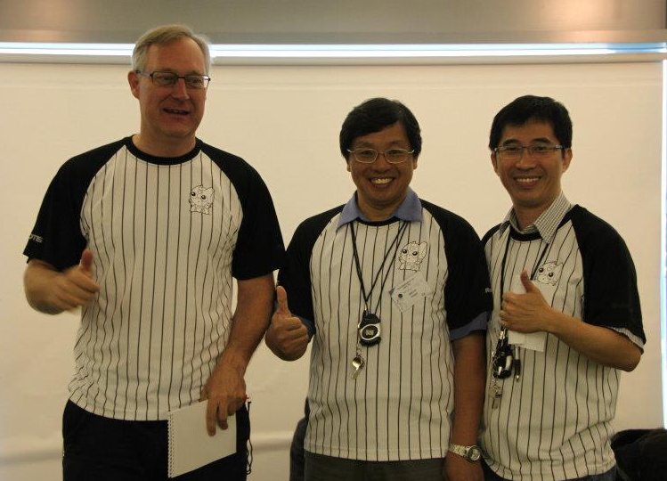

Version: 0.0.1 Date: Mon Apr 10 2017 08:37:45 GMT+0800 (HKT)
## HuroCup Laws of the Game
## Organization

Jacky Baltes

Educational Robotics Centre

National Taiwan Normal University

Taipei, Taiwan

[jacky.baltes@ntnu.edu.tw](jacky.baltes@ntnu.edu.tw)

*Abstract*

*The following rules and regulations govern the organization of HuroCup, a robotic game and robotics benchmark problem for humanoid robots.*

**Latest Version of the Rules for HuroCup**

The latest official version of the rules of the game for HuroCup is always available from the [HuroCup Facebook Page](https://www.google.com/url?q=http://www.facebook.com/groups/hurocup&sa=D&ust=1513944043563000&usg=AFQjCNHRB5oaekiHA9KJTvK0JvXWbIdZrw).

**Changes to the Organization Rules of HuroCup**

The HuroCup competition will add an extra event this year. Long jump is the first jumping competition for intelligent humanoid robots.

**Organization of the HuroCup Competition**

This section contains information about the organization and the running of the HuroCup competition. These rules are not actually part of the laws of the game, but rather specify organizational concerns such as the number and sequence of events, etc.

### [OG-1]: Number of Rounds per Event

[OG-1.1]: The local organizing committee determines the number of rounds  for the various events.

[OG-1.2]: If at all possible, the rounds for different events should be spread out  over several days. For example, the sprint events should not all take part on the same day.

[OG-1.3]: The local organizing committee determines whether if any of the rounds for an event can be scratched. For example, the local organizing committee may decide to count only the top two scores out of three rounds for an event to calculate a team's score for a single event. The number of rounds that are counted towards the final score is called the score count C.

### [OG-2]: Scoring of a Round

[OG-2.1]: In HuroCup events, the scoring of a single round in an event is based on the performance of the robot as well as its ranking amongst the other robots in a competition.

[OG-2.2]: The score of a robot in a round is between 0 (lowest performance) to 10 points (best performance).

[OG-2.3]: All robots that are unable to meet the minimum performance criteria set for a round, will automatically be awarded 0 points.

[OG-2.4]: The robots that have surpassed the minimum performance criteria for a round will be awarded points based on their ranking in this round. The point allocation is shown in [Table Point Allocation](https://docs.google.com/document/d/1kn2_dtNp65n1j5TjZWJVIlTKRFcNkTSpARkdhLHNA1c/pub#id.rzzlothp76e9).

Place | Points Scored
:---- | ------------:
1st   | 10
2nd   | 8
3rd   | 6
4th   | 4
5th   | 3
6th   | 2
7th   | 1
8th,9th,19th,... | 0

*Table Point Allocation*

*The point allocation for each round of an event in HuroCup*

### [OG-3]: Prizes and Awards

[OG-3.1]: The final score for a robot in an event is calculated as the sum of the top counted scores C results, where C is the score count determined by the local organizers (e.g., if before the event it is determined to count two out of three sprint events, then the score count C is two).

[OG-3.2]: The first prize is awarded to the robot with the maximum final score.

[OG-3.3]: In case of a tie, the maximum score of a robot in any individual round is taken as a tiebreaker.

[OG-3.4]: In case of two or more robots have the same final score as well as the same maximum score in individual rounds, the sum of the raw  performances (e.g., time, distance, number of successful tries or weight) is used as a tiebreaker. Each event may have special rules determining how to determine the how to break ties using the raw scores in an event.

[OG-3.5]: There will be a place award for the first, second, and third placed robot in each event as long as there are at least three robots that entered the event and all placed robots have a score that is greater than 0.

