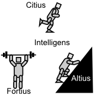
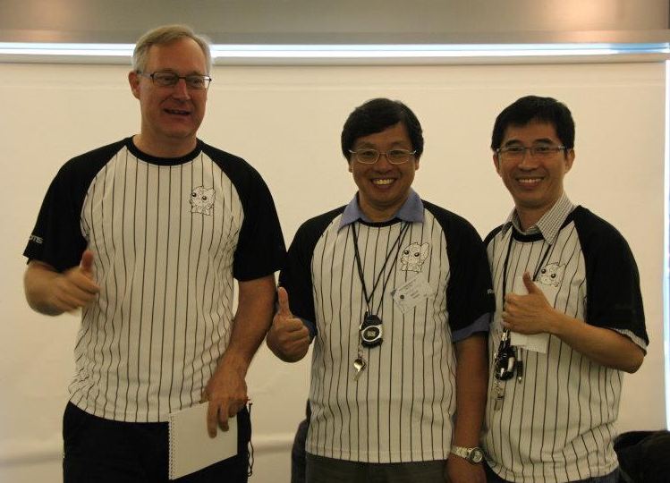

Version: 0.0.1 Date: Mon Apr 10 2017 08:37:45 GMT+0800 (HKT)

## HuroCup Laws of the Game  
## Organization

## HuroCup比赛的规则  
## 组织机构

Jacky Baltes

Jacky Baltes

Educational Robotics Centre

教育机器人中心

National Taiwan Normal University

台湾师范大学

Taipei, Taiwan

台北，台湾

[jacky.baltes@ntnu.edu.tw](jacky.baltes@ntnu.edu.tw)

[jacky.baltes@ntnu.edu.tw](jacky.baltes@ntnu.edu.tw)

*Abstract*

*摘要*

*The following rules and regulations govern the organization of HuroCup, a robotic game and robotics benchmark problem for humanoid robots.*

*以下规则适用于两种HuroCup组织，机器人比赛和人型机器人的机器人学基准问题*

**Latest Version of the Rules for HuroCup**

**HuroCup比赛规则的最新版本**

The latest official version of the rules of the game for HuroCup is always available from the [HuroCup Facebook Page](https://www.google.com/url?q=http://www.facebook.com/groups/hurocup&sa=D&ust=1513944043563000&usg=AFQjCNHRB5oaekiHA9KJTvK0JvXWbIdZrw).

HuroCup比赛规则的最新官方版本始终可从[HuroCup的Facebook页面](https://www.google.com/url?q=http://www.facebook.com/groups/hurocup&sa=D&ust=1513944043563000&usg=AFQjCNHRB5oaekiHA9KJTvK0JvXWbIdZrw)获得。

**Changes to the Organization Rules of HuroCup**

**HuroCup组织规则的改动**

The HuroCup competition will add an extra event this year. Long jump is the first jumping competition for intelligent humanoid robots.

HuroCup今年将额外增加一项赛事。跳远比赛将首次加入智能人型机器人。

**Organization of the HuroCup Competition**

**HuroCup竞赛的组织**

This section contains information about the organization and the running of the HuroCup competition. These rules are not actually part of the laws of the game, but rather specify organizational concerns such as the number and sequence of events, etc.

本节包含关于HuroCup组织和运行的信息。这些条例实际上并不算是比赛规则的一部分，而是详细说明了组织的关注点，比如赛事的数量和顺序等。

### [OG-1] : Number of Rounds per Event

### [OG-1] : 每项赛事的回合数

[OG-1.1] : The local organizing committee determines the number of rounds  for the various events.

[OG-1.1] : 当地组委会决定各项赛事的回合数。

[OG-1.2] : If at all possible, the rounds for different events should be spread out  over several days. For example, the sprint events should not all take part on the same day.

[OG-1.2] : 各种赛事的回合应该在几天内分散开，例如冲刺比赛不应该再同一天进行。

[OG-1.3] : The local organizing committee determines whether if any of the rounds for an event can be scratched. For example, the local organizing committee may decide to count only the top two scores out of three rounds for an event to calculate a team's score for a single event. The number of rounds that are counted towards the final score is called the score count C.

[OG-1.3] : 当地组委会决定是否不计入一项赛事的任一个回合。比如，当地组委会可以决定只计入一项赛事的三个回合中高分的两个回合，并以此来计算一个小组在本项赛事的分数。被最终计分的回合数称作分数统计变量C。

### [OG-2] : Scoring of a Round

### [OG-2] : 单回合的评分

[OG-2.1] : In HuroCup events, the scoring of a single round in an event is based on the performance of the robot as well as its ranking amongst the other robots in a competition.

[OG-2.1] : 在HuroCup赛事中，单个回合的评分取决于机器人的表现以及在其他机器人中的排名。

[OG-2.2] : The score of a robot in a round is between 0 (lowest performance) to 10 points (best performance).

[OG-2.2] : 单回合中机器人的得分介于0到10之间。

[OG-2.3] : All robots that are unable to meet the minimum performance criteria set for a round, will automatically be awarded 0 points.

[OG-2.3] : 所有的表现不符合最低标准的机器人将自动获得0分。

[OG-2.4] : The robots that have surpassed the minimum performance criteria for a round will be awarded points based on their ranking in this round. The point allocation is shown in [Table Point Allocation](https://docs.google.com/document/d/1kn2_dtNp65n1j5TjZWJVIlTKRFcNkTSpARkdhLHNA1c/pub#id.rzzlothp76e9).

[OG-2.4] : 超过最低表现标准的机器人将根据他们在本回合的排名获得积分。分配方式见下表。

Place | Points Scored
:---- | ------------:
1st   | 10
2nd   | 8
3rd   | 6
4th   | 4
5th   | 3
6th   | 2
7th   | 1
8th,9th,19th,... | 0

排名 | 得分
:---- | ------------:
第1名   | 10
第2名   | 8
第3名   | 6
第4名   | 4
第5名   | 3
第6名   | 2
第7名   | 1
第8名,第9名,第19名,... | 0

*Table Point Allocation*

*点分配表*

*The point allocation for each round of an event in HuroCup*

*HuroCup中每一回合的点分配*

### [OG-3] : Prizes and Awards

### [OG-3] : 奖项

[OG-3.1] : The final score for a robot in an event is calculated as the sum of the top counted scores C results, where C is the score count determined by the local organizers (e.g., if before the event it is determined to count two out of three sprint events, then the score count C is two).

[OG-3.1] : 被计分的C个结果的总和即总分，C是由当地组委会决定的（比如，若赛前确定计入三个回合中的两个，那么C就是2）。

[OG-3.2] : The first prize is awarded to the robot with the maximum final score.

[OG-3.2] : 总分最高的机器人将获得一等奖。

[OG-3.3] : In case of a tie, the maximum score of a robot in any individual round is taken as a tiebreaker.

[OG-3.3] : 在平局的情况下，在所有单回合中的最高分较高的一方视为决胜者。

[OG-3.4] : In case of two or more robots have the same final score as well as the same maximum score in individual rounds, the sum of the raw  performances (e.g., time, distance, number of successful tries or weight) is used as a tiebreaker. Each event may have special rules determining how to determine the how to break ties using the raw scores in an event.

[OG3.4] : 若依据[OG-3.3]仍然不能决出胜负，则原始表现数据（例如，时间，距离，成功尝试次数或重量）将作为决胜依据。每一项赛事都会有各自的规则，决定如何使用原始表现数据来确定胜负。

[OG-3.5] : There will be a place award for the first, second, and third placed robot in each event as long as there are at least three robots that entered the event and all placed robots have a score that is greater than 0.

[OG3.4] : 只要分数超过0的机器人至少有3个，则本项赛事中的第一，二，三名都会获得一个奖励。
