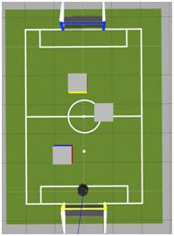
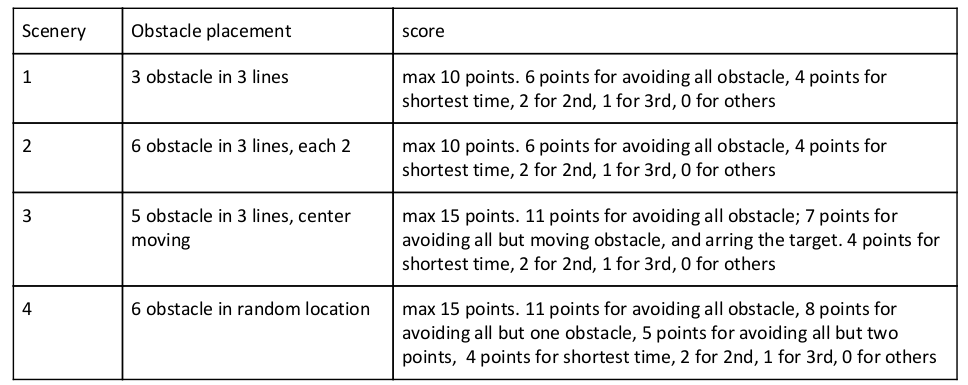
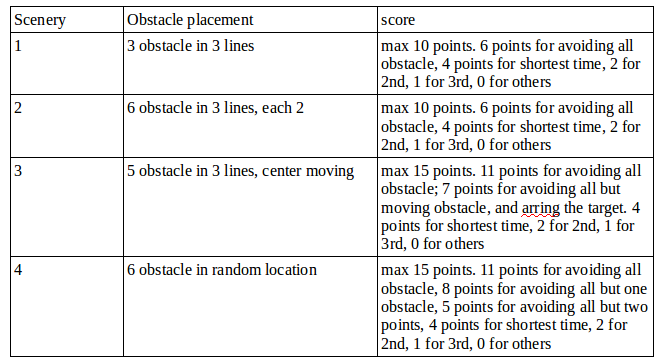

# SimuroSot Robo Challenge Obstacle Avoidance

### Testing Time
Before the game starts, each team will have an independent 2-minutes testing time by turns.

### Mainly
Each team needs to complete a series challenge three times.

### Field
A white rectangle is the competition field of avoidance challenge, which is sized 300cm*600cm, shown as Fig. 1.

### Obstacles placing rules:
The obstacle is a cube with 50cm*50cm*50cm. The obstacle placement will be different with different scenery and different challenge.

>  
>Figure 1 Field for SimuroSot Robo Challenge.  

## 1 Introduction
The following rules and regulations govern the game of SimuroSot Robo Obstacle avoidance challenge.  The rules and regulations stated are to ensure a fair competition takes place. The objective of the SimuroSotRobo Obstacle avoidance challenge is to allow researchers to develop control algorithms, path planning andobstacle identification strategies without the need of complex and costly hardware setup. Teams are encouraged to use the simulation platform for the evaluation of their algorithms and eventually to participlein the RoboSot obstacle avoidance challenge which is exposed to real world conditions.

## 2 Platform
#### 2.1. The simulation software
The simulation software must be operated on a computer system with or better than the following system
configurations.

- RAM 8192 MB
- Screen resolution 1024 x 768
- UBuntu 16.04
- ROS Kinetic
- A 3D Graphics accelerator Card

The simulation platform is based on ROS Kinetic, and is open source, you can get it form  
https://github.com/zerowind168/SIMUROSOT-ROBOCHALLENGE

#### 2.2. The field dimensions
A green carpet playground 300cm X 600cm in size with 2.5cm thick white lines around it.  

#### 2.3. Markings on the field
The field shall be marked as shown in Figure 6.1. The center circle will have a radius of 37.5cm.  

The major lines/arcs (centerline, goal area borderlines and the center circle) shall be white in color of 3mm thickness. The free ball positions shall be marked in grey color.  

#### 2.4. The goal, goal line and goal area
The goal shall be 40cm wide. The goal line is the line just in front of the goal which is 40cm long. The goal area (Region A) shall comprise of the area contained by the rectangle (sized 50cm X 15cm in front of the goal).

## 3 Game Component & Processing

#### 3.1. Duration

The duration of a game shall be two equal periods of 5 minutes each, with a half time interval for 10 minutes. Anofficial timekeeper will pause the stopwatch during substitutions, during timeout and during such situations that deem to be right as per the discretion of the timekeeper.

If a team is not ready to resume the game after the halftime, additional 5 minutes shall be given. If the team is still not ready to continue the game after the additional time, the team will be disqualified from the game.

## 4 The 1st challenge event
In this event, the obstacle position are given by the server when client program first get up. You need to make a good control of you robot motion to avoid the obstacle. And you may also make a good path planning strategy.

- The event contain four scenery, For each scenery, the team will have three test, the average score will be the final score.

#### 4.1. Scenery 1
There are 3 obstacle located in three lines. 1/4 lines, half lines and 3/4 lines.

#### 4.2. Scenery 2
There are 6 obstacle located in three lines. 1/4 lines, half lines and 3/4 lines. each line has two obstacle.

#### 4.3. Scenery 3
There are 6 obstacle randomly located in the ground.

#### 4.4. Scenery 4
There are 5 obstacle, two at the 1/4 lines, two at the 3/4 lines. one in the half lines and the middle one will randomly moving along the lines.

## 5 The 2nd challenge event
In this event, the obstacle position are NOT given. You need to control your robot to avoid the obstacle by using only the camera on your robot.

- The event contain four scenery, For each scenery, the team will have three test, the average score will be the final score of the scenery.

#### 5.1. Scenery 1
There are 3 obstacle located in three lines. 1/4 lines, half lines and 3/4 lines. But the actually location is unknown.You need to avoid the obstacle according to your vision.

#### 5.2. Scenery 2
There are 6 obstacle located in three lines. 1/4 lines, half lines and 3/4 lines. each line has two obstacle. But theactually location is unknown. And you need to avoid it according to your vision.

#### 5.3. Scenery 3
There are 6 obstacle randomly located in the ground. And the actually location is unknown. And you need to avoidit according to your vision.

#### 5.4. Scenery 4
There are 5 obstacle, two at the 1/4 lines, two at the 3/4 lines. one in the half lines and the middle one willrandomly moving along the lines. The actually location of static obstacle is unknown. And you need to avoid itaccording to your vision.

## 6 Game Commencement
Before the commencement of each scenery, all team need to copy their code to the client computer. And the team match sequence shall be determined by a draw. Before the beginning of each scenery, the team is allowed to change its program.For a scenery, the position of obstacle may different for different test case. The actually test case is also determined by a draw.

## 7 End of the Game
At the end of the game, the team should remove or delete their team strategy files from the client computer.

## 8 The Referee
Every match is controlled by a referee who has full authority to enforce the Laws of the Game in connection with the match to which he has been appointed. The referee shall communicate with both team members in English unless it is agreeable by both teams and the referee/assistant referee that other languages are allowed to be used.

 The referee:

- Enforces the Laws of the Game.

- Controls the match possibly in co-operation with assistant referees.

- Stops, suspends or terminates the match, at his discretion, for an infringements of the Laws

- Stops, suspends or terminates the match because of outside interference of any kind Acts on the advice of assistant referees regarding incidents which he has not seen.

- Ensures that no unauthorized persons enter the field of play. ​ Only one representative per team is authorized to speak with the judge and it must be defined before the match beginning.

- When the referee makes a decision and a team does not agree with it, his representative can expose his reason. He only has one minute to do it, then the opposing team has the opportunity to do it for a minute too if they want. After that the referee MUST take a decision.

- Takes action against team officials who fail to conduct themselves in a responsible manner and may at his discretion, expel them from the field of play and its immediate surrounds.

## 9 Method of Scoring
#### 9.1. The winner
The team with the highest score will be the winner.

#### 9.2. Score for Challenge One  
  

#### 9.2. Score for Challenge Two  
  
In the event of a tie.
