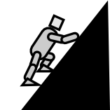
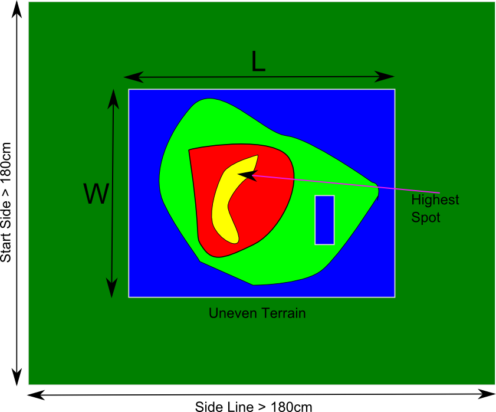

### Spartan Race - HuroCup Laws of the Game
----------
#### Version: 15.1.1 Date: Sun May 21 2017 19:53:22 GMT-0500 (CDT)

### HuroCup Laws of the Game
### Spartan Race (Pro)
    
>**1Jacky Baltes and ^2Kuo-Yang Tu**  
>**1Educational Robotics Center**  
>**Department of Electrical Engineering**  
>**National Taiwan Normal University**
>**Taipei, 10610, Taiwan**  
>**[jacky.baltes@ntnu.edu.tw](jacky.baltes@ntnu.edu.tw)**  
>**2Institute of Electrical Engineering**  
>**National Kaohsiung First University of Science & Technology**  
>**[tuky@nkfust.edu.tw](tuky@nkfust.edu.tw)**  
>****  
>**Abstract**  
>**The following rules and regulations govern the spartan race event of HuroCup, a robotic game and robotics benchmark problem for humanoid robots.**

### Latest Version of the Rules for HuroCup
The latest official version of the rules of the game for HuroCup is always available from the [HuroCup Facebook Page](https://www.google.com/url?q=http://www.facebook.com/groups/hurocup&sa=D&ust=1514023717305000&usg=AFQjCNE4cAuVtCSpSZ15N8P84ye9jPRMfg).

### Changes to the Spartan Race rules of HuroCup
The Spartan Race event was introduced in 2017 for the combination of both Lift & Carry and Wall Climbing into a single event.  

### Spartan Race
The goal of this competition is to provide an event for the research of enhancing the mobility of humanoid robots.  Thus the design of playing field is aimed at the humanoid robots  to use active balancing, push recovery, complex motion planning, coordination, and execution to increase the range of usable motions.

The playing field includes three parts: uneven terrain, ladder and rope.  The robot must start at a random spot around the uneven terrain.  Once the robot walks across over the uneven field, it must autonomously hold a bar in ladder for climbing. The robot must walk over the uneven terrain and then climb up by ladder and rope, respectively.

The robot that can finish the parkour as quickly as possible is declared the winner.

### HuroCup Spartan Race - Laws of the Game
The following laws describe the specifics of the spartan race event. For general specifications relevant to all HuroCup events (e.g., robot dimensions, playing field and lighting, responsibility of the referees) please refer to General - HuroCup Laws of the Game.

### [SR-1]: Field of Play

[SR-1.0]: The playing field is divided into three parts: uneven terrain, ladder and rope.  The layout sequence is uneven terrain, ladder and then rope.

[SR-1.1]: The uneven terrain is allocated at the middle of a region with a minimum dimension of 1.8m by 1.8m. See Figure [Uneven Terrain](https://docs.google.com/document/d/1mh1xXGr970a3S0qakOopx7g8n-JDd2HS7DaYFoopPfo/pub#id.ixs3eoov7s9f).

[SR-1.2]: The uneven terrain consists of sheets of hard material such as corrugated plastic, corrugated cardboard, or wood.

[SR-1.3]: The length of the uneven terrain is approximately $L.

[SR-1.4]: The width of the uneven terrain is approximately $W.

[SR-1.5]: The thickness of a single sheet is $H.

>
>
>|Dimension |Comment |Kid Size |Adult Size |
>|:-|-|-:|-:|
>|$L |Length of Uneven Terrain |3m |3 m |
>|$W |Width of Uneven Terrain |3m |3m |
>|$H |Height of Sheets |15mm - 25mm |15mm - 25mm |
>|$CD |Diameter of coins |30mm - 60mm |30mm - 60 mm |
>|$CT|Thickness of coins |< 8mm |< 8mm |
>
>Uneven Terrain   The region of uneven terrain. The task for the robot is to cross the uneven terrain repeatedly.

|-|
|Uneven Terrain A sample uneven terrain playing field for the lift and carry event.|

[SR-1.6]: The uneven terrain is constructed by placing random cut-outs of the sheets on top of each other. The cut-outs may contain holes.  The exact shape of the uneven terrain is determined by the local organizing chair.

[SR-1.7]: Several coins or washers of diameter $CD will be placed at random on the playing field. The thickness of the coins or washers is less than $CT.

[SR-1.8]: The sheets are colour coded, that is sheets at different heights have different colours as shown in Figure [Uneven Terrain](https://docs.google.com/document/d/1mh1xXGr970a3S0qakOopx7g8n-JDd2HS7DaYFoopPfo/pub#id.d06beo3fm8xk).

>
>The Ladder and Rope

>|Name |Comment |Kid Size |Adult Size |
>|:- |:- |-: |-: |
>|$W |Width of Ladder |40cm to 60cm |40cm to 60cm |
>|$RD |	Rung Spacing |10cm - 20cm |20cm - 40cm |
>|$A |Angle to Floor |45 degree |45 degree |
>|$SD |	Distance from Start to Wall |20cm |50cm |
>|$PD |Rope Height above top rung of the ladder |30cm |50cm |
>|$PL |Rope Length |250cm - 350cm |250cm - 350cm |
>
>Dimensions of Ladder and Rope.

[SR-1.9]: The dimensions of the region for ladder and rope are at least 200 cm by 200 cm as shown in Figure [Ladder and Rope](https://docs.google.com/document/d/1mh1xXGr970a3S0qakOopx7g8n-JDd2HS7DaYFoopPfo/pub#kix.ud5kjrh7h0c8).

[SR-1.10]: At one end of the uneven terrain, there is a ladder made out of wood or metal or other suitable material.

[SR-1.11]: The width of the ladder is $W. The frame of the ladder is painted in white or black.

[SR-1.12]: The rungs of the ladder are unevenly spaced. The distance between the rungs will be between $RD. The colour of the rungs is red. The centre of each rung is marked with a separate colour.

[SR-1.13]: The ladder is mounted at an angle of approximately $A degrees between the floor and the ladder.

[SR-1.14]: At the end of the ladder a rope is attached. The rope is uniformly coloured. One end of the rope is attached to the bottom of the highest rung and it extends approximately horizontally.

### [SR-2]: Number of Robots

[SR-2.1]: A single robot competes in a match.

### [SR-3]: The Players

[SR-3.1]: Please refer to [General - HuroCup Laws of the Game](https://www.google.com/url?q=https://docs.google.com/document/d/15laUlB6uZ56J5WpGPhepb7P8O7ul-8K5sgdf4uwu4Ak/pub&sa=D&ust=1514023717330000&usg=AFQjCNGdNFdQ7_9Wt0g73brjKB6NIC5OvQ) for detailed information about the players.

### [SR-4]: The Referee

[SR-4.1]: Please refer to [General - HuroCup Laws of the Game](https://www.google.com/url?q=https://docs.google.com/document/d/15laUlB6uZ56J5WpGPhepb7P8O7ul-8K5sgdf4uwu4Ak/pub&sa=D&ust=1514023717331000&usg=AFQjCNF7cSuWzuvqE1cAoqv2f4aEYBmAiA) for detailed information about the referee and his or her duties.

### [SR-5]: The Assistant Referee

[SR-5.1]: Please refer to [General - HuroCup Laws of the Game](https://www.google.com/url?q=https://docs.google.com/document/d/15laUlB6uZ56J5WpGPhepb7P8O7ul-8K5sgdf4uwu4Ak/pub&sa=D&ust=1514023717332000&usg=AFQjCNErSlWRz2_jLGv9Oqbe48aFb9oXlw) for detailed information about the assistant referee and his or her duties.

### [SR-6]: Game Play

[SR-6.1]: A single robot is designated the runner. All other robots must be outside of the playing field.

[SR-6.2]: The only robot allowed to move during a run is the designated runner.

[SR-6.3]: The runner will be placed at the start location. The start location is approximately 50cm to the edge of the uneven terrain and the climbing wall.

[SR-6.9]: If a robot fails during any part of the competition, the team can reset the robot and restart from the start location.

[SR-6.4]: The referee will signal the start of the competition by blowing the whistle.

[SR-6.5]: After the referee gives the start signal, the robot can move to either the uneven terrain or the wall climbing field.

[SR-6.6]: The robot can score points by climbing to the highest point on the uneven terrain.

[SR-6.7]: Once the robot has successfully reached the highest point on the uneven terrain, it can score points by descending and leaving the uneven terrain. The robot has left the uneven terrain if both feet touch the ground outside of the uneven terrain.

[SR-6.10]: The robot is not allowed to fall during the walking on uneven terrain. The only parts of the robot that are allowed to touch the ground are its feet.

[SR-6.11]: To score points in the wall climbing, the robot must start climbing the wall. The robot must walk attempt to climb as high as possible on the ladder.

[SR-6.11]: After reaching the top of the ladder, the robot must continue its climb along the rope.

[SR-6.13]: The climbing distance of the robot is defined as the height above ground of the lowest robot part while the robot is in a stable configuration during the climb of the ladder or the maximum height of the ladder plus the distance that the robot was able to traverse on the rope and maintain a stable configuration. The distance along the rope is measured from the closest point of the robot to the center of the top rung of the ladder. A robot is in a stable configuration if it is statically stable for more than 3 seconds.

[SR-6.14]: Each robot may have at most one human handler associated with it.

[SR-6.15]: The human handlers are not allowed to interfere in any way with other robots, the referee, or other human handlers.

[SR-6.16]: A human handler may only enter the playing field or touch his/her robot with the permission of the referee.

[SR-6.17]: The end of the competition is signaled by the referee by blowing the whistle a second time. The referee terminates the competition if

1. the robot leaves the uneven terrain before reaching the highest spot.
2. the maximum duration of the competition (5 minutes) has elapsed,
3.  the robot has not progressed in the climb for more than 1 minute.
4.  the robot was unable to reach the highest spot and then leave the field within 5 minutes,

[SR-6.18]: At the end of the run, another robot will be designated the runner.

### [SR-7]: Fouls and Misconduct

[SR-7.1]: The robot does not step directly onto the uneven terrain at the start of the run.

[SR-7.2]: The robot leaves the playing field without stepping onto the highest point first.

[SR-7.3]: The robot handler touches the robot without permission of the referee.

[SR-7.4]: Any infractions as listed by [General - HuroCup Laws of the Game](https://www.google.com/url?q=https://docs.google.com/document/d/15laUlB6uZ56J5WpGPhepb7P8O7ul-8K5sgdf4uwu4Ak/pub&sa=D&ust=1514023717336000&usg=AFQjCNEM_mCAOmLEQNhIAZC0rhWUGfCykw) as far as they are applicable in this event.

[SR-7.5]: Any team that commits one of the infractions listed in this section will be penalized by having the run declared invalid.

### [SR-8]: Method of Scoring

[SR-8.1]: Any robot that has not reached the highest spot and left the uneven terrain at least once is automatically awarded no rank and 0 points.

[SR-8.3]: Within a round, the time to reach the highest position at the ladder will be used as a tiebreaker. That is if two or more robots reach a position at the ladder successfully, then the time for the run is used as a tiebreaker.

[SR-8.4]: For more details about the point allocation, please refer to Point Allocation [Organization - HuroCup Laws of the Game].

### [SR-9]: Tiebreaker

[SR-9.1]: In case two or more robots have the same number of points after all rounds in the spartan race event, the sum of the successful tries will be used a tiebreaker.

[SR-9.2]: In case two or more robots have the same number of points after all rounds and are still tied after applying the previous tiebreaker, the maximum number of successful runs in a single round will be used as tiebreaker.

[SR-9.3]: In case two or more robots are still tied after applying the previous tiebreaker, the time for the maximum number of successful runs in a single round will be used as tie breaker.
